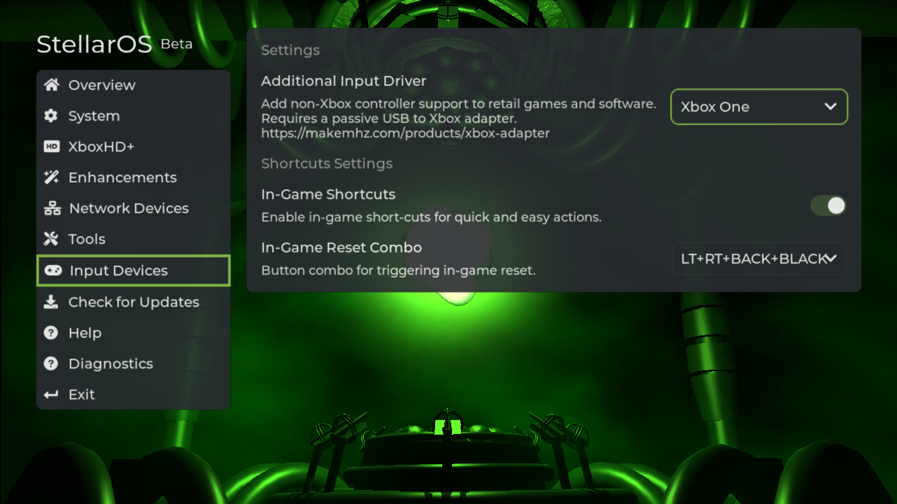

# Input Devices

## Overview
The ``Input Devices`` page is where you can find settings for additional input drivers and settings for in-game shortcuts.

## Additional Input Driver
The ``Additional Input Driver`` ofeature is designed to manage the use of extra USB drivers for applications operating on the Xbox.
To connect game controllers, you can either utilize a [MakeMHz Xbox USB Adapters](https://makemhz.com/products/xbox-usb-adapter) or make your own.

**Supported and Tested Controllers**
- Offical Microsoft Xbox One Controllers
- Offical Microsoft Xbox Series Controllers

**Unsupported Devices**
- Microsoft Xbox Wireless Adapter for Windows

:::info
You might need to reconnect Xbox One controllers each time the system resets its USB ports. Such resets can occur during system boot-up or reboot, when launching a new title, or if a game executes a soft-reset.

This requirement stems from a known firmware issue in the Xbox One controller. We are currently investigating a solution and hope to implement a workaround that will effectively address this problem in a future update.
:::

:::tip
Our list of compatible devices is continuously growing as we actively work to include more first and third-party controllers.

Currently, there are some limitations with our additional input driver support. For solutions and workarounds, we encourage you to consult our [Knowledge Base](/project-stellar/knowledge-base).

If you encounter a problem not covered in our [Knowledge Base](/project-stellar/knowledge-base), we would like you to share it with us on our [Discord server](https://discord.gg/9YcuDpY). This allows us to document and address new issues promptly, ensuring a more comprehensive support system for all users.
:::

## In-Game Shortcuts
The ``In-Game Shortcuts`` section provides an array of settings for configuring shortcuts that can be activated in-game through specific combinations of controller button presses.
