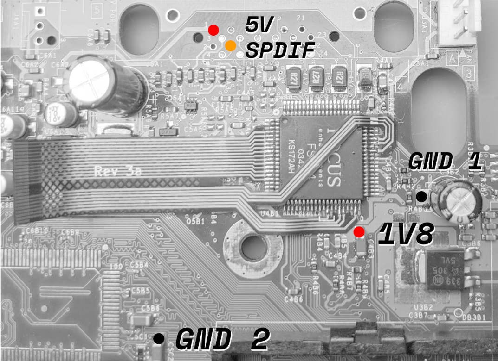

# Stellar XboxHD+ Troubleshooting

### Blinking LED (No Signal)
A blinking LED on the Stellar XboxHD+ board indicates that a valid video signal is not being detected. This issue often
arises due to an improperly soldered ``HSYNC``, ``VSYNC``, or ``CLK`` connection. For reference on these specific signals,
please consult the flex installation section of the Stellar XboxHD+ guide.

In some cases, the problem may be caused by a faulty HDMI cable or display. Before making any adjustments, try using a
different HDMI cable or a different TV. Whenever possible, test the XboxHD+ by connecting it directly to a TV.

:::note
Pressing the power button on the Xbox will start it up normally, while using the eject button will boot the system
into safemode. Safemode runs at 480p.

Try both methods to determine if the display issue is associated with a particular video resolution.
:::

## Xbox 1.0 - 1.5 QSB Verification

### Step 1
Basic QSB verification and troubleshooting can be found in the [XboxHD+ QSB installation guide](http://localhost:3000/xbox-hdmi/installation/qsb-hd#verificationtroubleshooting).

### Step 2 (Advance)
With the XboxHD+ fully installed (flex cable connected, wires soldered, Stellar link cable attached, etc.), power on the Xbox.

Using a multimeter set to measure voltage, test for the 1.8V supply provided by the QSB board. For a convenient measuring point,
refer to the image below, which highlights an accessible test location for the 1.8V line.

Connect the multimeter’s ground lead to any ground referenced below or to the system’s RF shielding.

If the voltage is below 1.8V, first confirm that the ferrite bead has been removed as instructed. If it has, re-examine
the solder points on the QSB board to ensure proper connection.

If the voltage remains incorrect, the QSB board may be faulty (contact support).

