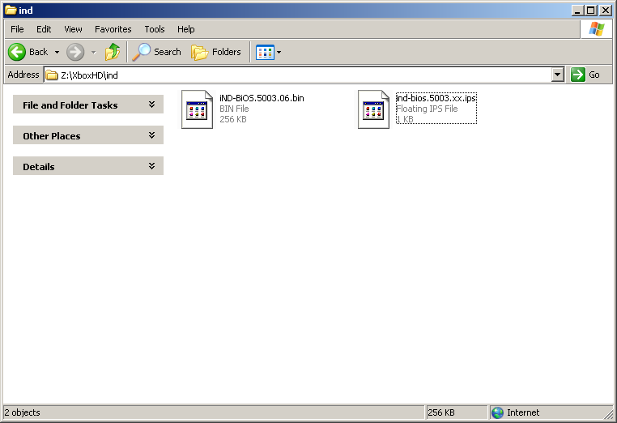
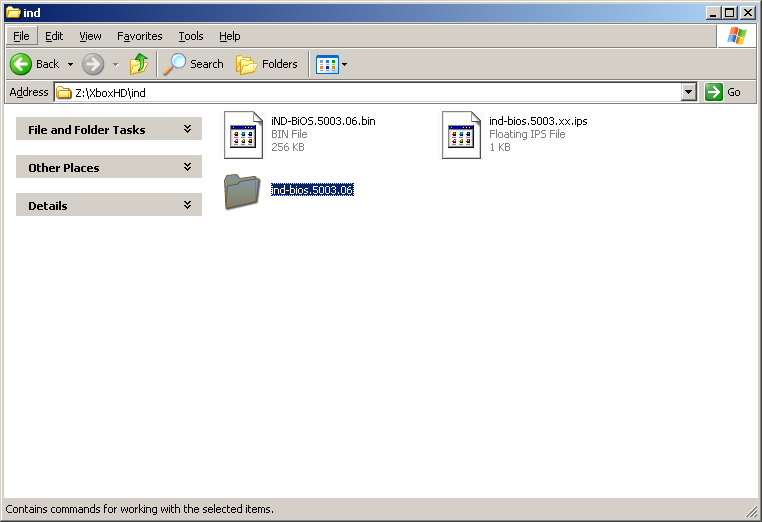
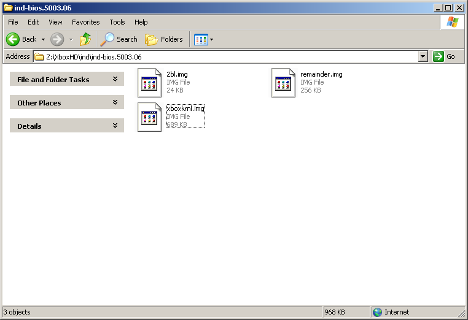
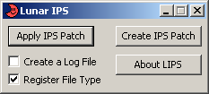
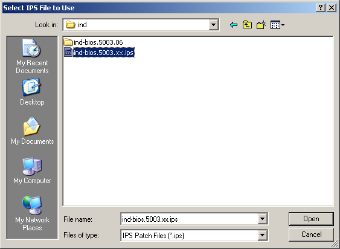
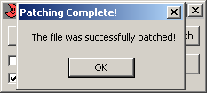
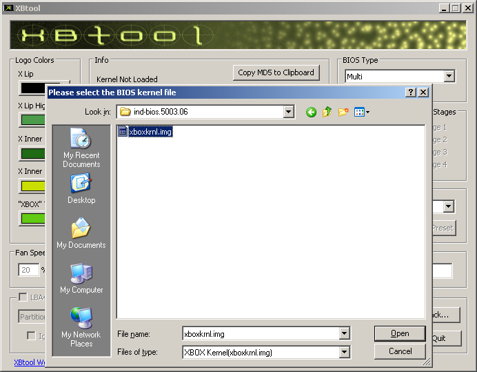
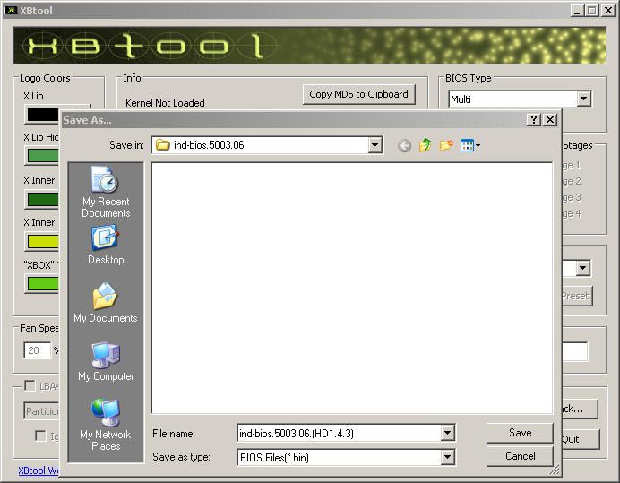

# ind.5003.xx
This guide is for patching the ind.5003.xx BIOS.

:::tip
Say goodbye to the hassle of software patching! With [Project Stellar](https://makemhz.com/products/stellar),
enjoy a seamless installation experience where software patching becomes a thing of the past.
:::

Start by placing the IPS patch inside of an empty folder with the ind.5003.xx BIOS.

Open XBtool, choose 'Multi' for BIOS Type, and click ‘Unpack’, then choose your BIOS for the system you’re patching.

At this point, you should have an xboxkrnl.img file inside subfolder of the BIOS location.

Now open up Lunar IPS and click ‘Apply Patch’

Choose the ind-bios.5003.xx.ips patch file.

Set 'Files of type:' from 'Most Common ROM Files' to 'All Files' and choose the xboxkrnl.img

Now open back up XBtool, choose 'Multi' for BIOS Type, and click 'Pack'. Choose the patched xboxkrnl.img

For the 'Save As' give the new BIOS a unique name, such as ind-bios.5003.06.(HD1.4.3), and click save.

Your BIOS is now patched! Flash the BIOS to your modchip of choice and verify by launching the XboxHD+ app.

:::danger
Flashing the modified HDMI BIOS to the console's TSOP is not supported. You have been warned!
:::
