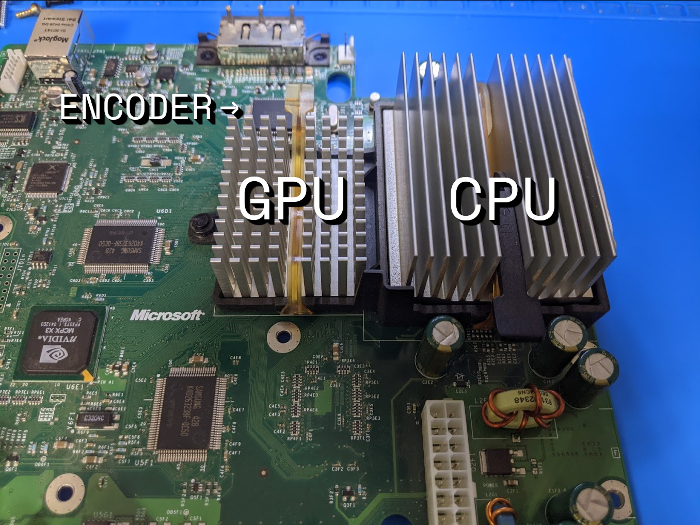
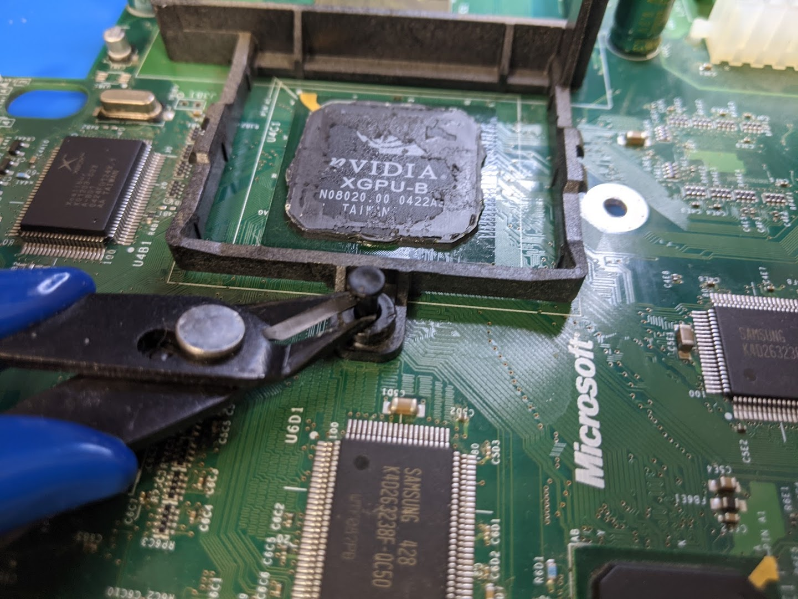
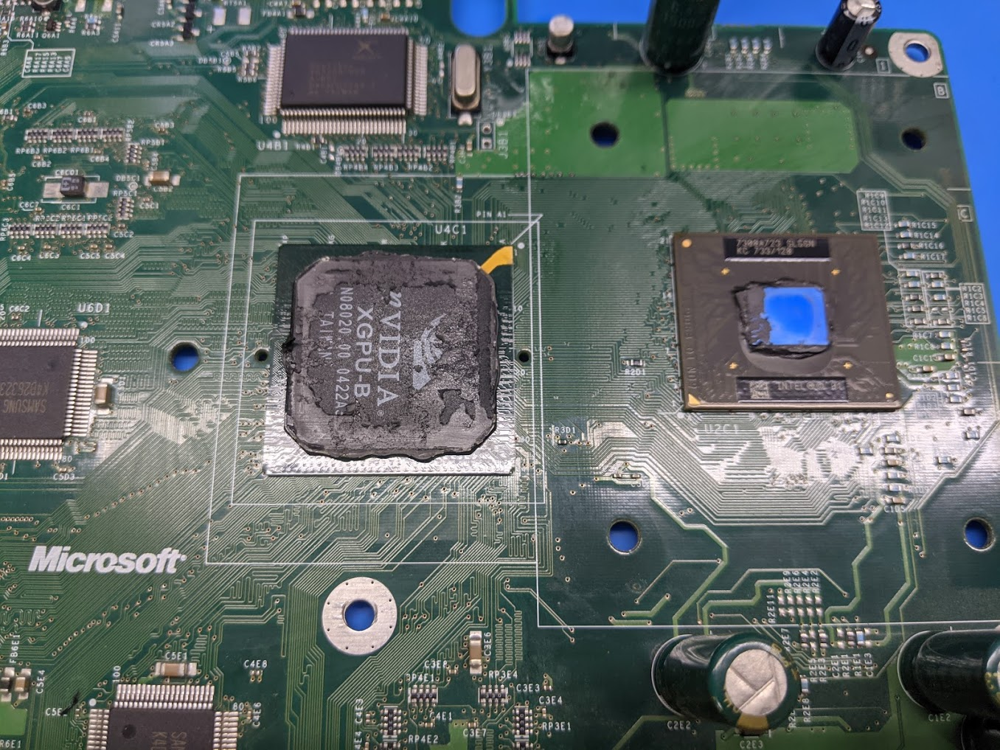
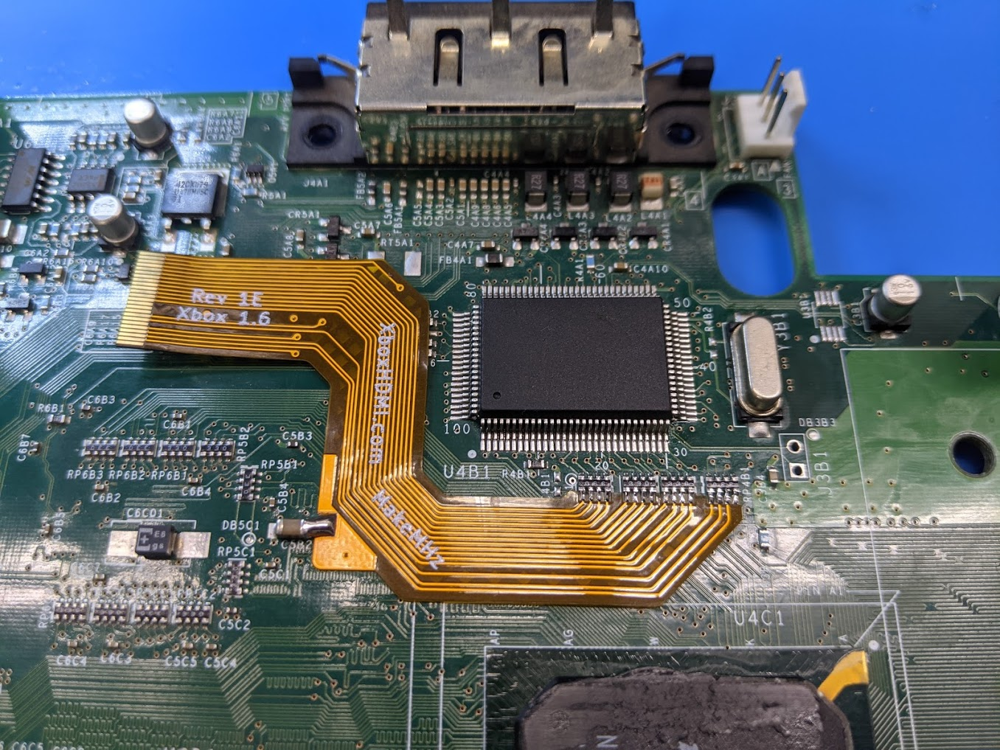
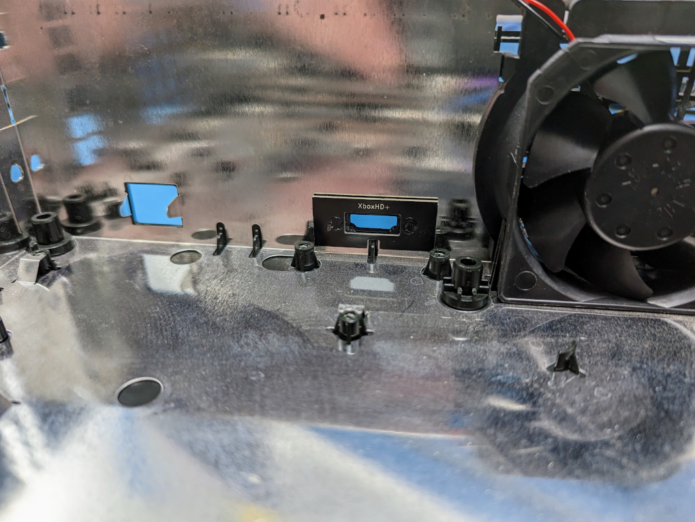

# Stellar XboxHD+ (Xbox 1.6)
Installation guide for the Stellar XboxHD+ on Xbox revision 1.6.

:::caution
This guide is for the installation of a Stellar XboxHD+ kit.
:::

### Brief Overview
For a brief overview, check out the YouTube video below.

### Kit Contents
Check your kit for missing or damaged pieces before moving forwards.

- XboxHD+ Main Board
- XboxHD+ 1.6 Flex PCB
- 26AWG Stranded Red Wire for the 5V.
- 26AWG Stranded Orange Wire for the SPDIF connection.
- 26AWG Stranded Black Wire for the ground connections.
- 3D printed board spacer
- 3D printed HDMI port cover
- 2 mounting screws

### Preparation
:::danger
Make sure to carefully read the entire document in full before you start! Familiarize yourself with all the steps and how they are to be carried out. Do not skip any steps, and use the provided pictures to compare your results.
:::

Before your adventure begins, it's imperative to ensure that you have a fully working, tested, and modified Xbox.

Please thoroughly test your system before attempting to install the XboxHD+ kit.
This guide also assumes that you watched the installation video linked above.

This guide is for Xbox motherboard revisions 1.6 with an Xcalibur video encoder.

### Step 1 - Project Stellar Installation
The first step of install the Stellar XboxHD+ is installing and updating Project Stellar. Project Stellar has it's own guide [here](/project-stellar/installation-guide).

**Make sure you're at least on firmware version v1.0.1 before continuing.**

### Step 2 - Wire Prep
It's imperative to cut each wire as close as possible to our recommendations, but not shorter. If additional wire is needed, then make sure to use wire of similar quality and gauge.

After cutting each wire, strip each side. It's recommended for the cleanest install to strip about 2mm from one side (for the connections to the Xbox motherboard) and about 3mm on the other side (for connections to the XboxHD+ board). Make sure to twist the stranded wires and pre-tin each one.

**Cut List and Lengths (end to end, before stripping)**

<table>
  <tr>
    <th>Black Wire</th>
    <td>3cm</td>
    <td>GND Connection</td>
  </tr>
  <tr>
    <th>Red Wire</th>
    <td>4cm</td>
    <td>5V Connection</td>
  </tr>
  <tr>
    <th>Orange Wire</th>
    <td>4cm</td>
    <td>SPDIF Connection</td>
  </tr>
</table>

### Step 3 - Motherboard Prep
The first step is to remove the motherboard from the Xbox. There are plenty of guides on the internet on how to do so and won't be repeated here as it's pretty straight-forward.

It's required to remove the CPU heatsink, GPU heatsink, and the motherboard heatsink mounting bracket. We've found that the best approach is to apply very low heat to the heatsink, around 100°C / 212°F, while applying very light force twisting to the heatsink.

:::caution
It's very important not to force the heatsink off by attempting to pull it straight up as this could damage the GPU.

There's been at least one person who's managed to do this in the past, unrelated to the project, and even though it's very unlikely, it's noted here to let others know to be careful!
:::

The thermal compound on the GPU can be cleaned off with a basic solvent such as Arctic Silver Arcticlean Thermal Cooling Material Remover or with WD-40. When re-applying the heatsink, make sure to add **ample** PC thermal paste. *(in this case, more is better as a bit too much should not effect thermals and is ultimately safer as the GPU does not have an embedded thermal sensor for overheating protection).*

Next up is removing the heatsink mount. The pins can be a bit tricky to pop out. We've found that using side cutters to wedge them out works nicely. (Just be careful not to cut them)

With the pins removed the heatsink mount can be removed by pushing it out from the back.

After this, you can remove the AV port. Please refer to the installation video for more information on the different ways to accomplish this.

And finally, make sure to clean the area where the flex will be installed with IPA.

### Step 4 - Jumper Wires
This step gets its own section as it's very easy to forget, and can be a pain if forgotten since the pins are located on the bottom of the board.

We need to make two connections on the bottom of where the AV port used to be, so that the Xbox thinks that an HD AV cable is plugged in. Use a scrap piece of wire to make these connections.

### Step 5 - Flex Installation
This section will be mostly screenshots of the Xbox video encoder and where the flex connects. Pay close attention to the alignment of the flex cable and **take your time while installing!**

Start with soldering the flex unto the resistor network and then solder the ground pad last. Unlike the 1.0 - 1.5, the 1.6 flex does not have pads on the bottom of the flex. Make sure you have solid joints!

After the flex is installed, the Xbox should still be bootable.

#### Best Practices
- Pre-tin the top side of the flex by applying ample flux and running solder across each pad before soldering to the Xbox motherboard.
- Take your time!

**Completed Install**

### Step 6 - Aux Wires
Start with connecting each of the pre-cut wires. The wires for 5V and SPDIF should lay flat across the motherboard running towards the right.

#### AV Port/Encoder Connections
Connect each of the pre-cut wires according to the wire cut chart above. The wires for 5V and SPDIF should lay flat across the motherboard running to the right. The wire for GND should run downwards.

### Step 7 - Wrapping Up

#### 3D Printed HDMI Panel
Insert the 3D printed HDMI part in the Xbox case as pictured below.

### Re-install the Xbox Motherboard
Place the Xbox motherboard back into the case. Make sure to screw the motherboard back in. There's one screw located under where the XboxHD+ will be installed.

#### 3D Printed Spacer
Place the provided spacer as shown below.

### Install the XboxHD+ Board
Begin by adding solder to all of the connection pads (GND, SPDIF, 5V). This is important as there's little room once everything is installed.

Place the XboxHD+ board in the system and screw it down with the two provided screws.

:::danger
Make sure to use the two provided torx screws. A longer philips head screw is provided for Project Stellar, but will cause case damage if installed for the HD+.
:::

Connect each wire to its corresponding pads on the XboxHD+ board.

Carefully connect the flex cable to the FPC connector. Be very careful. it may take a couple of tries as sometimes the flex will want to go in at an angle. if this happens, then pull it out and gently push it back in.

:::danger
Do not force the flex cable into the FPC connector. Make sure the flex is not inserted at an angle!
:::

Connect the Stellar link cable from the Project Stellar to the XboxHD+. It is recommended to connect the cable to Stellar while it's not on the pin header to avoid unnecessary stress on pin header.

