# XboxHD+ Software
This guide is for the installation of the XboxHD+ software and kernel patch.

:::tip
Say goodbye to the hassle of software patching! With [Project Stellar](https://makemhz.com/products/stellar),
enjoy a seamless installation experience where software patching becomes a thing of the past.
:::

## Checklist
- [ ] OpenXenium installed.
  - [ ] Tested and verified that OpenXenium is accessible via network. (Both HTTP and FTP)
- [ ] System is fully working.

## Hard Drive Preparation

### Step 1
Boot console to XeniumOS via the eject button.

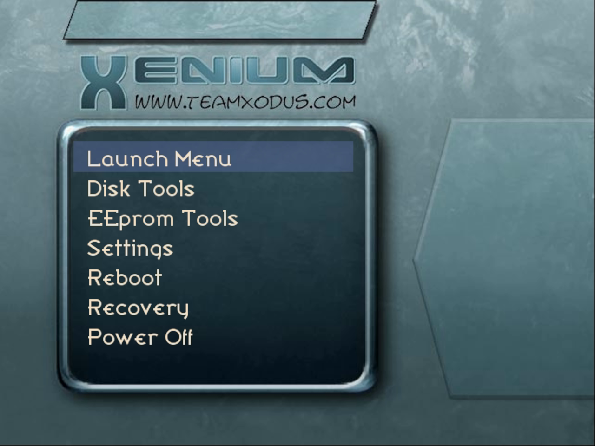

### Step 2
Download the latest XboxHD+ app release.

[Latest Release](https://github.com/MakeMHz/xbox-hd-plus-app/releases/latest)

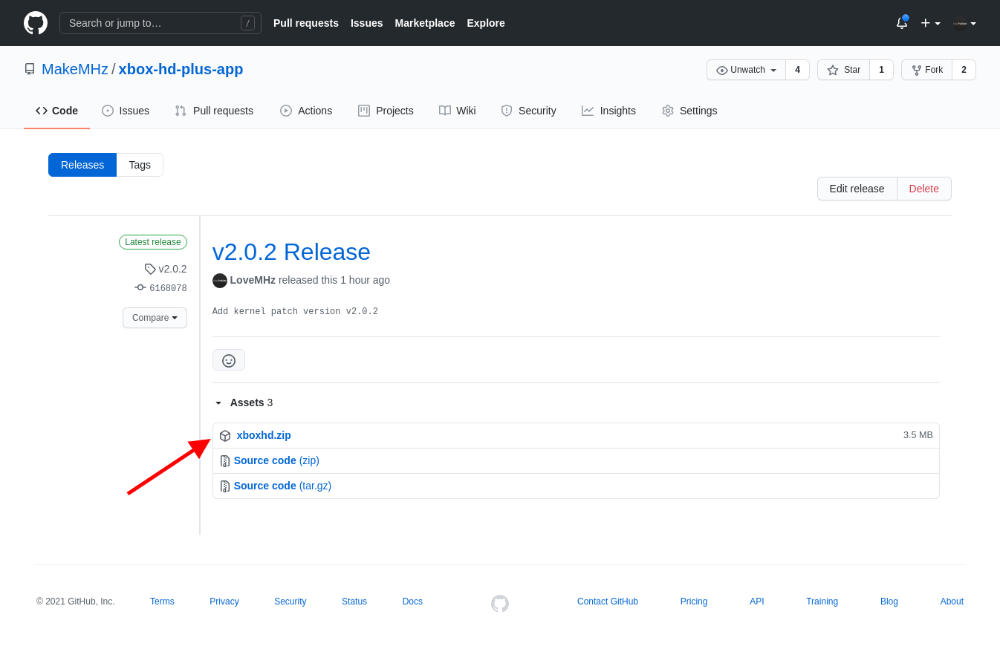

### Step 3
Extract the files and FTP over contents to the C drive. Files must be placed on the C drive. (Inside of a folder called 'xboxhd' as shown)

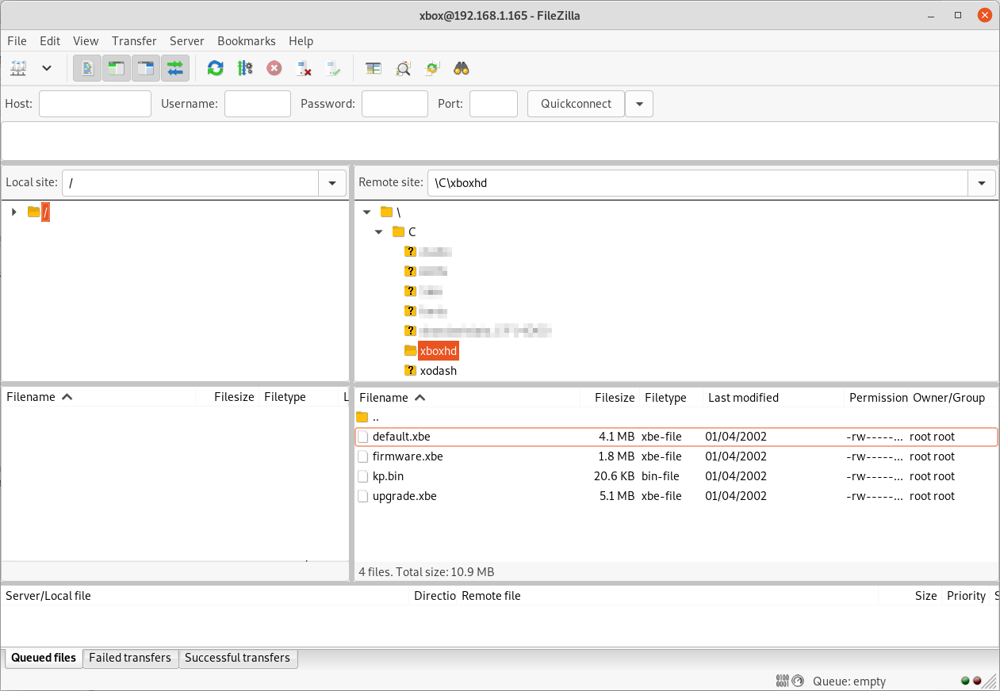

### Step 4
Leave Xbox on and continue to the next section.

## Patching BIOS with kpatcher Support

### Step 1
Download the latest kpatch IPS file for your BIOS of choice.

[BIOS Patches](/patches/README.md#xbox-kernel-patches-kpatch---xboxhd)

### Step 2
Apply patch to BIOS by following the link to the patching guide for the corresponding BIOS patch. (Due to legal reasons we can not distribute the BIOS files)

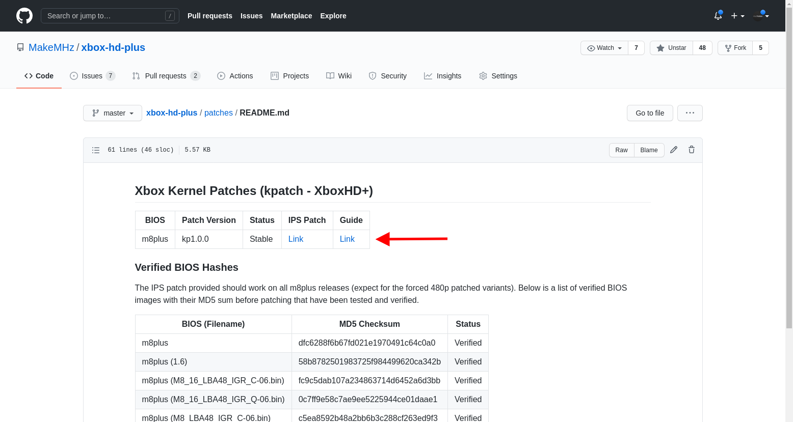

### Step 3
FTP the patched BIOS file over to Xbox. It's recommended to store the BIOS file inside of a folder on the C drive called 'BIOS' for future refrences.

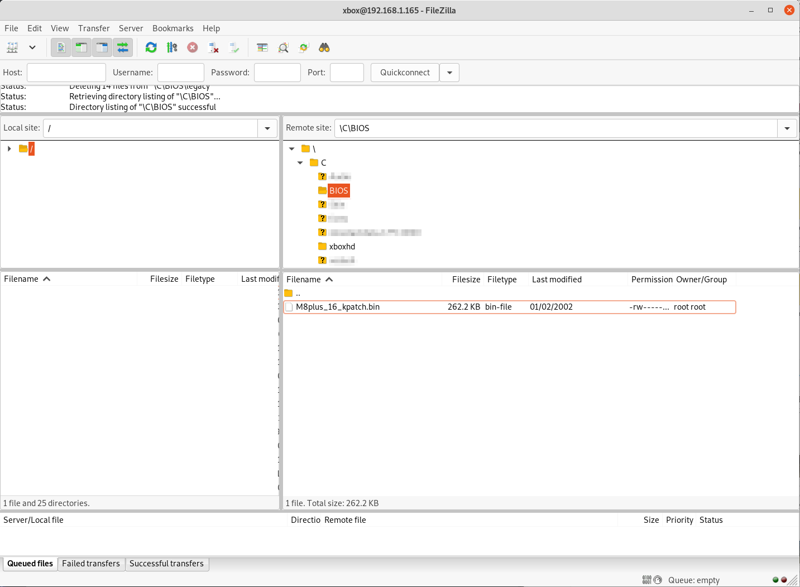

### Step 4
Flash BIOS.

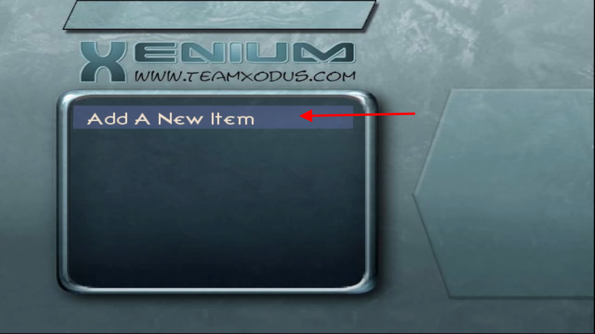

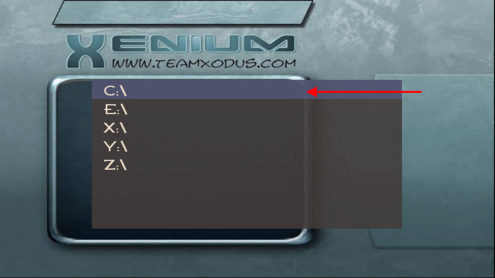
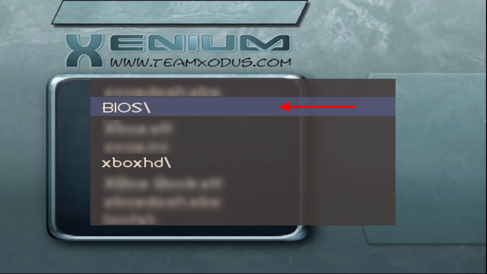
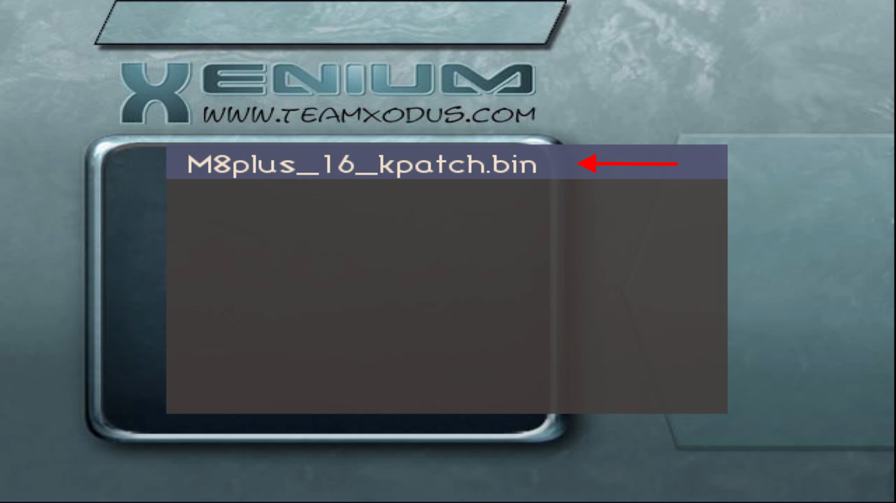
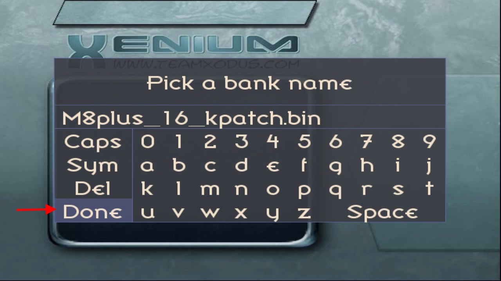
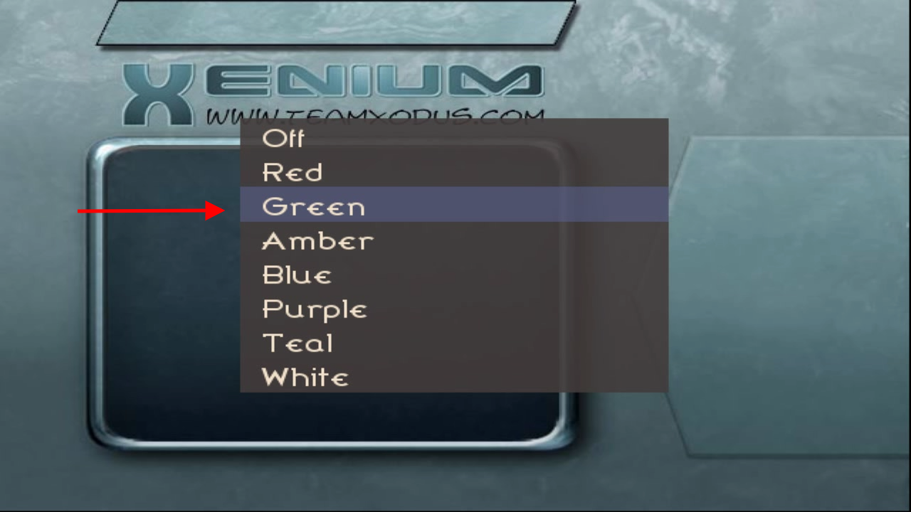

### Step 5
Set the newly flashed BIOS as the default BIOS.

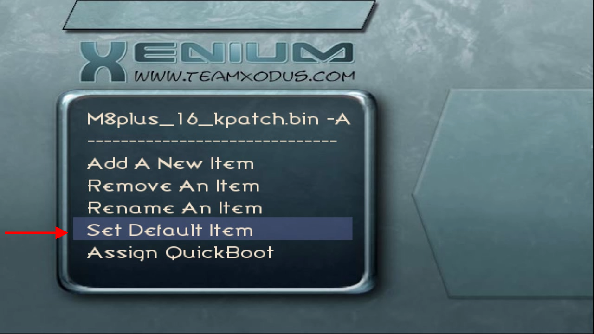
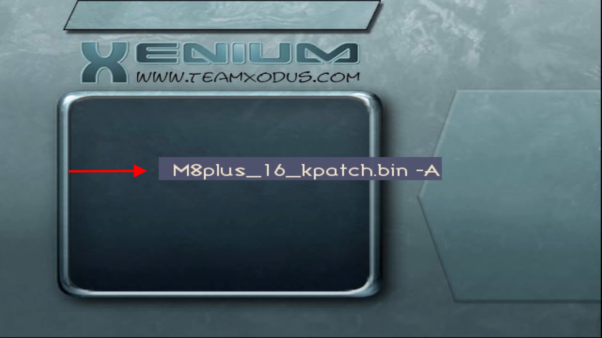

### Step 6
Ensure that 'Instant Boot' is enabled. This automatically boot the default BIOS on power up.

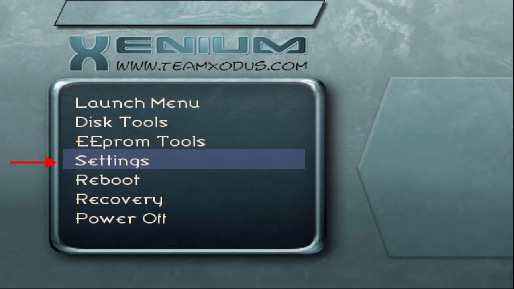
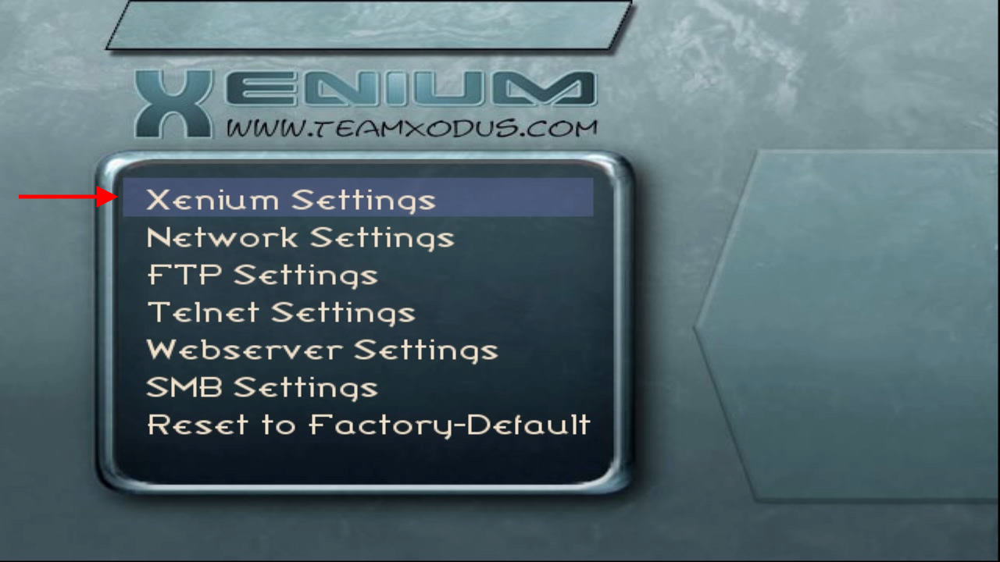
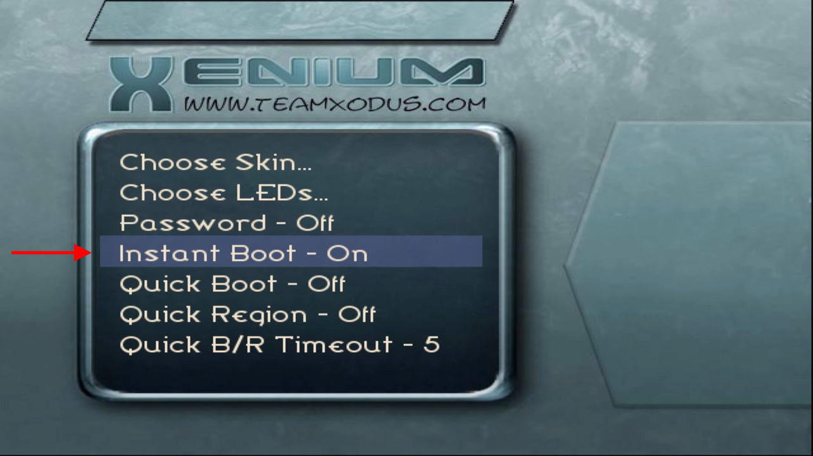

## Verification
At this point you can reboot the Xbox. This will boot the patched BIOS.

### Step 1
Launch the XboxHD+ app. If all went well you should now see the configuration app and text that says 'Kernel patch loader detected'.
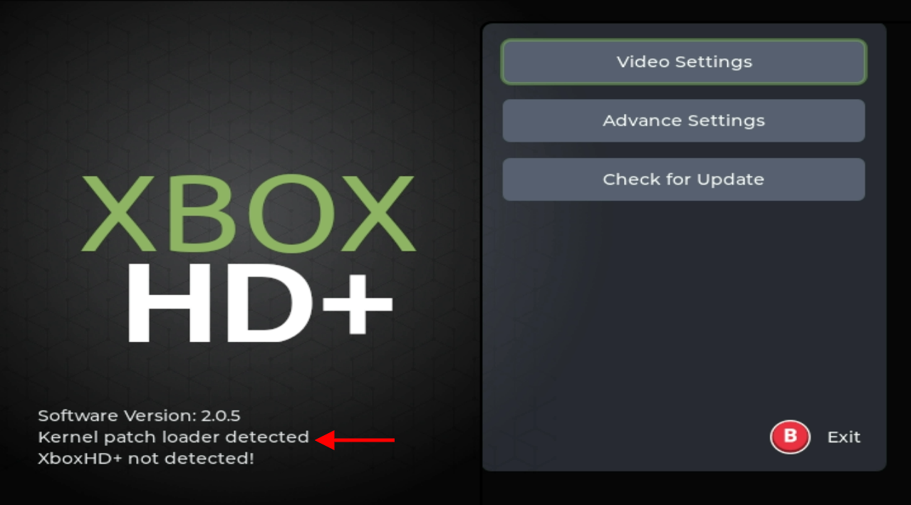

## All Done
And that's it! Installation of the XboxHD+ kit can now continue.
